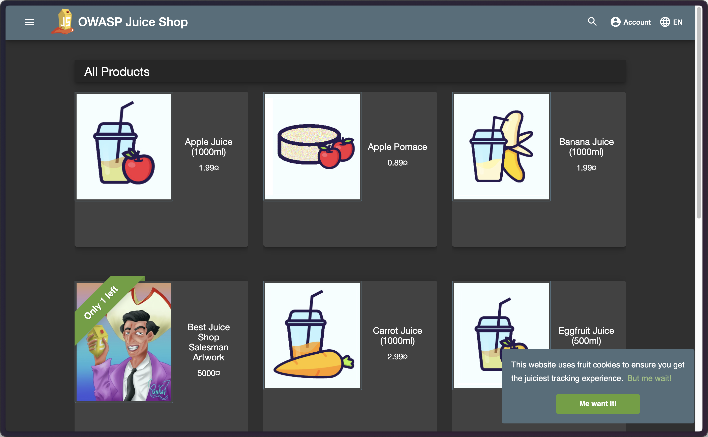
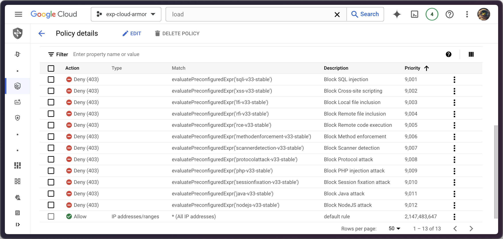
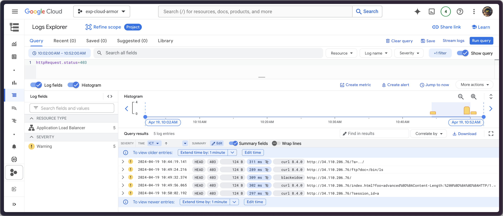

# Cloud Armor Preconfigured WAF Rules

## Architecture


## OWASP Juice Shop page


## Cloud Armor rules


## Testing

Observe Cloud Armor protection with OWASP ModSecurity Core Rule Set

```sh
PUBLIC_SVC_IP=<lb-ip-address>
```

1. In Cloud Shell, confirm the LFI vulnerability is mitigated:

```sh
curl -Ii http://$PUBLIC_SVC_IP/?a=../
```
Output:

```
HTTP/1.1 403 Forbidden
<...>
```

2. In Cloud Shell, confirm the RCE attack is mitigated:

```sh
curl -Ii http://$PUBLIC_SVC_IP/ftp?doc=/bin/ls
```

Output:

```
HTTP/1.1 403 Forbidden
<..>
```

3. In Cloud Shell, confirm well-known scanner detection.

```sh
curl -Ii http://$PUBLIC_SVC_IP -H "User-Agent: blackwidow"
```

Output:

```
HTTP/1.1 403 Forbidden
<..>
```

4. In Cloud Shell, confirm a protocol attack is mitigated.

Per the OWASP ModSecurity Core Rule Set ver.3.0.2, the protocol attack is mitigated by:

```sh
curl -Ii "http://$PUBLIC_SVC_IP/index.html?foo=advanced%0d%0aContent-Length:%200%0d%0a%0d%0aHTTP/1.1%20200%20OK%0d%0aContent-Type:%20text/html%0d%0aContent-Length:%2035%0d%0a%0d%0a<html>Sorry,%20System%20Down</html>"
```

Output:

```
HTTP/1.1 403 Forbidden
<..>
```

5. In Cloud Shell, confirm session fixation attempts are blocked:

```sh
curl -Ii http://$PUBLIC_SVC_IP/?session_id=a
```

Output:

```
HTTP/1.1 403 Forbidden
<..>
```



## Reference
[Cloud Armor Preconfigured WAF Rules](https://partner.cloudskillsboost.google/focuses/57169?catalog_rank=%7B%22rank%22:1,%22num_filters%22:0,%22has_search%22:true%7D&parent=catalog&search_id=30728457)